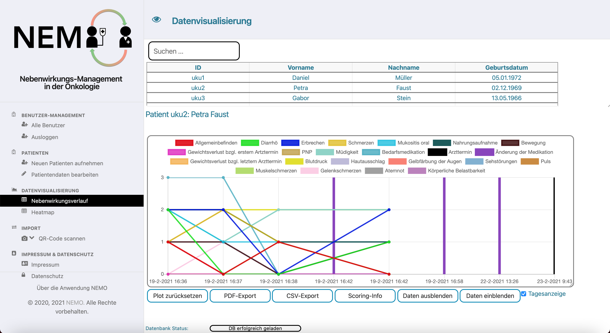

# NEMO Desktop App

The NEMO (German, Nebenwirkungsmanagement Onkologie) desktop app is the counterpart for the NEMO smartphone app. It is developed as cross-platform Electron desktop app with JavaScript, HTML and CSS.

It is created for clinicians who monitor their patients in oncology therapy, who use the NEMO smartphone app to track the side effects of therapy.

The NEMO desktop app presents a detailed visualization of all occurred adverse events per day as well as over time. The events can be provided day-by-day or over longer periods, allowing a more individual adjustment of the therapy. Additionally, physicians can choose between a line plot or a heat map. This allows patient individualized adverse event tracking over time. 
The tracked records of patients are transmitted via a sequence of QR codes, therefore the NEMO desktop app requires a connected camera.


*Line plot for the adverse effects over time for a single patient.*


*Editing of the core data and medication of a patient.*


## Installation

Download the binaries for your operating system below:
* [Mac OS X](https://github.com/sysbio-bioinf/NEMODesktop/binaries/mac/NEMO.dmg)
* [Windows](https://github.com/sysbio-bioinf/NEMODesktop/binaries/win/NEMO-1.0.0-setup.exe)

For macOS, open the dmg and drag & drop the NEMO icon to the Applications folder. The app can then be started by clicking on the NEMO icon.
For Windows, double click on the installer and NEMO will automatically be installed on your system. 

To run the NEMO desktop app in the Terminal or Windows PowerShell:
```bash
# Installation of Node.js and Electron to run the desktop application:
$ apt-get install nodejs
$ apt-get install npm
$ npm install electron --save-dev

## Building
$ cd NEMODesktop
# create package.json if necessary
$ ./create_PackageJson.sh 
# otherwise run
$ npm install
# start electron
$ npm start
```


## Development

Clone this project from Github and switch to the downloaded directory:
```halb 
git clone git@github.com:sysbio-bioinf/NEMODesktop.git
cd NEMODesktop
```

NEMO Desktop app is organized as an [Electron](https://www.electronjs.org/) app.
